# AI retail operations platform — food, retail and logistics

> One platform for restaurants, minimarkets and cash & carry businesses: sales across every
> channel, inventory, logistics, CRM and an AI assistant that performs real operations.

**Role**
CRM · Warehouse · Supplier · Cost · HACCP · Loyalty · Logistics with driver tracking and route assignment · Scales, POS and fiscal-register integrations · Forecasting and what-if layer

**Status**
In production

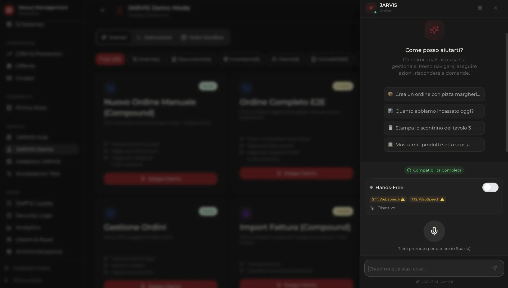

---

## The problem

A food business runs on systems that were never designed to meet: a till, a delivery app, a
supplier spreadsheet, a loyalty card scheme and a fridge with expiry dates in it. Each one is
correct on its own and wrong together. The owner is the integration layer, and the questions that
actually matter — *which products are below minimum, what does opening a second location do to my
margin, which supplier is quietly costing me* — take a week of manual work to answer, which means
they are never asked.

## What I built

An operations platform where the sale, the stock movement, the supplier cost and the customer
record are the same event seen from different modules. On top of that: an assistant that can
**execute** operations, and a forecasting engine that can answer questions about a business that
does not exist yet.

## Key capabilities

### Selling, everywhere
POS with barcode scanning and separate channels for in-store, phone, WhatsApp, external delivery,
online, pickup and home delivery. A restaurant floor with tables, bookings, covers, kitchen and
waiters. A public site with menu, product customisation, wallet checkout and a points-and-rewards
loyalty programme.

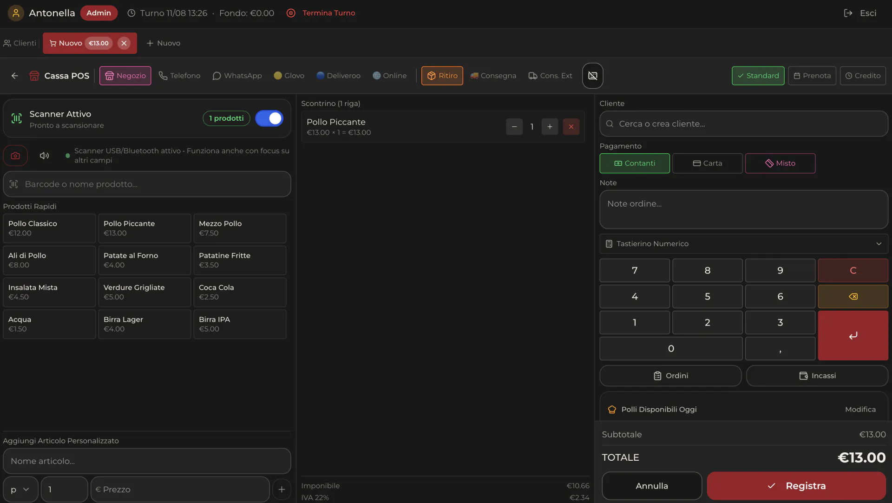
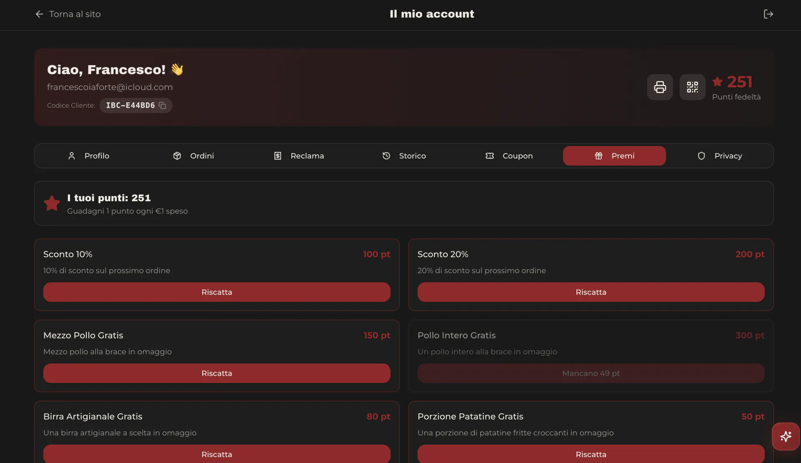

### Knowing what you have
Inventory with critical stock, expiry dates, lots, categories, supplier mapping and consumption.
HACCP alongside it, because in food the compliance record and the stock record describe the same
physical item.

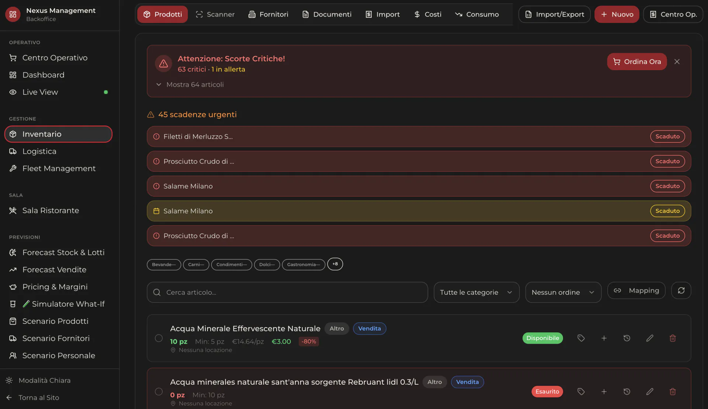

### Getting it there
Logistics and fleet management with a live courier map, shipments, inbound arrivals, vehicles,
fuel, maintenance and a courier portal, with intelligent route assignment.

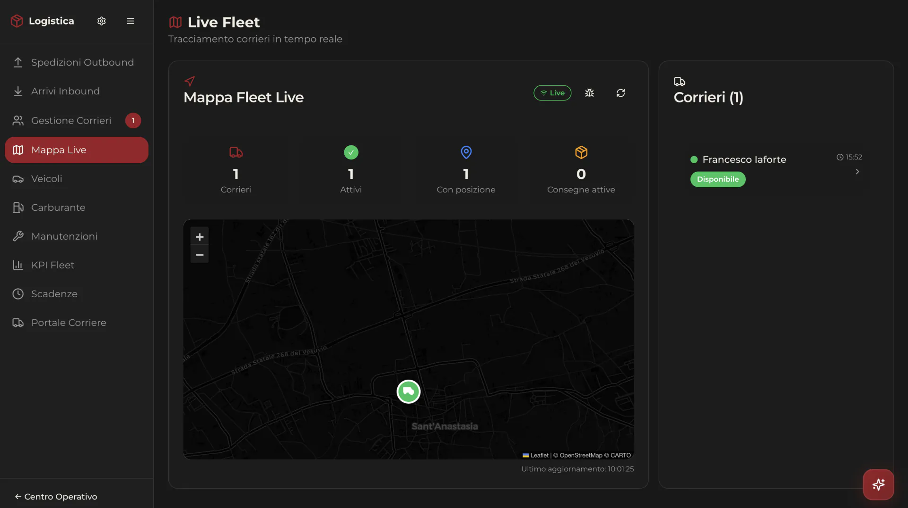

### Watching it happen
A real-time Live View over the visitor → cart → checkout → purchase funnel.

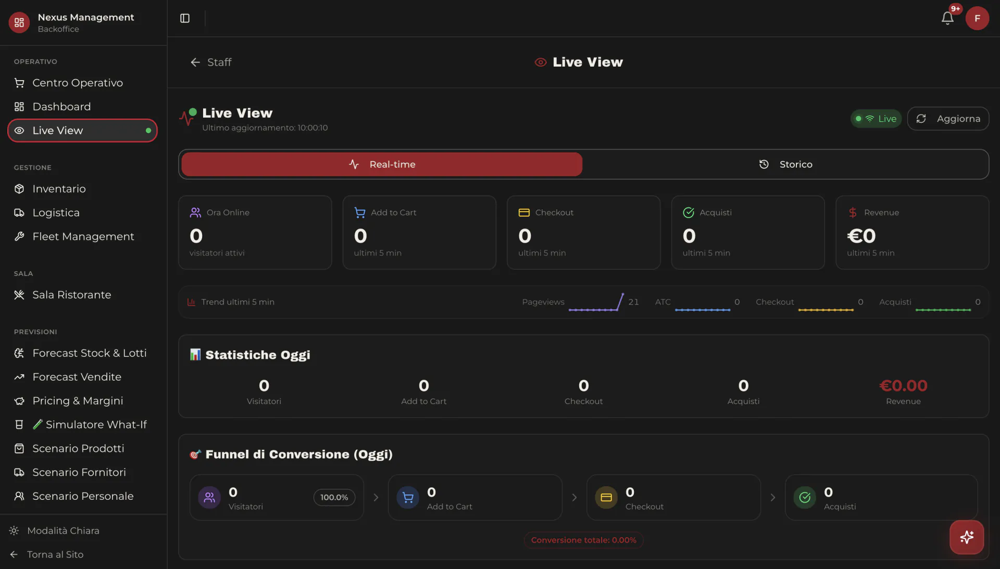

### An assistant that acts
An AI assistant that navigates the platform and performs real actions — create orders, print
receipts, query the warehouse — including a hands-free voice mode for people whose hands are busy.

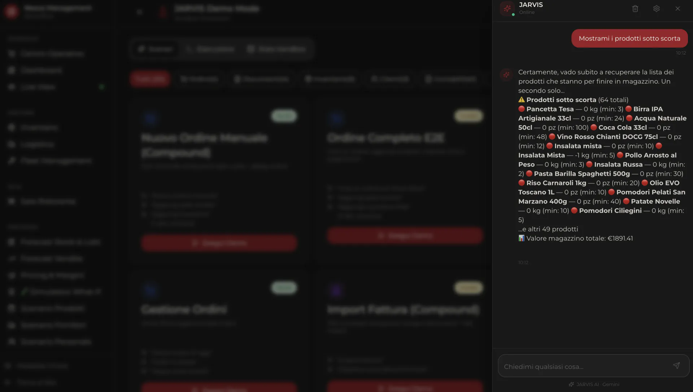

### Deciding with numbers
Sector benchmarks against national statistics, business risk scored per category, a what-if
simulator, product/supplier/staff scenarios, a catalogue of 65 external datasets and cross-module
AI data collection.

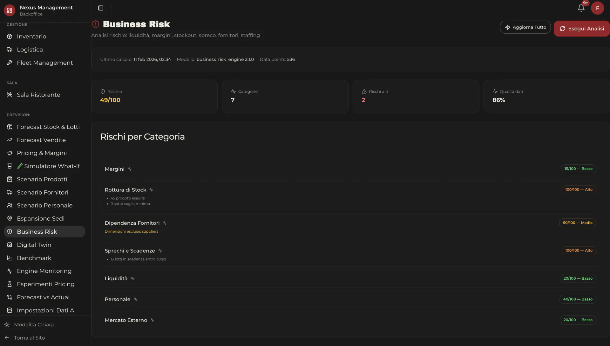
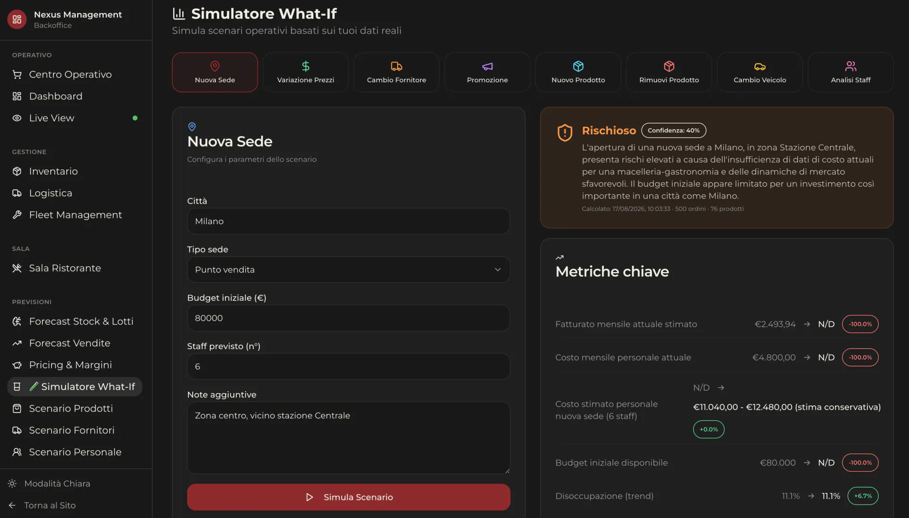
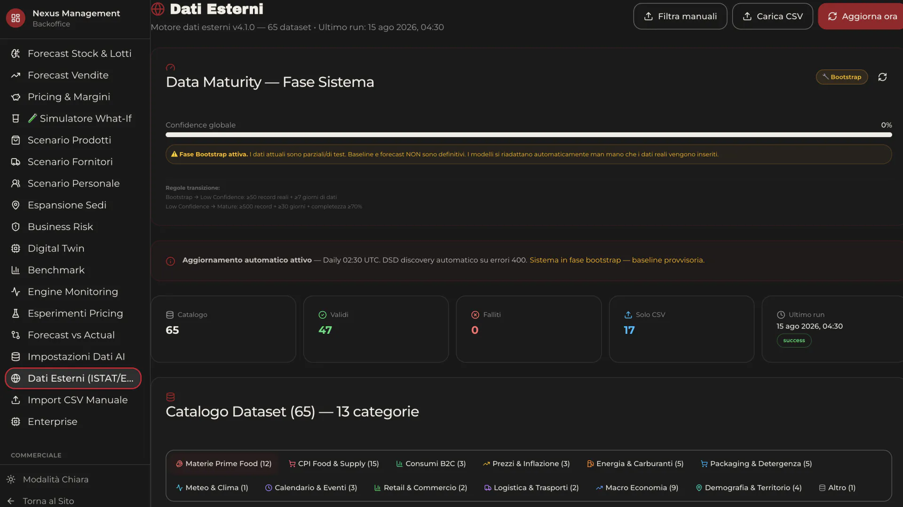

## Architecture


## Engineering decisions

**Bounded operations, caller permissions, a result the user can verify.** Wiring an LLM to the
platform's real actions is a different problem from wiring it to a search index. That constraint
shaped the assistant more than the model choice did.

**One data foundation, collected across modules.** Forecasting is only as good as what it can
see, so collection is a cross-module concern with an explicit coverage map, rather than each
module exporting its own extract.

**External data as a managed catalogue.** National statistics are treated as a catalogue of
datasets with validity status and automatic refresh, not as a one-off import. A benchmark that
silently goes stale is worse than no benchmark.

**Scenarios as first-class objects.** What-if simulation, product and supplier scenarios and
business-risk scoring share the same model of the business, so a scenario answer is consistent
with the dashboard next to it.

**Channels separated at the order level.** In-store, phone, WhatsApp, delivery, online, pickup and
home delivery behave differently in fulfilment, margin and tax. Modelling them as one "order" with
a label would have collapsed under the first reconciliation.

## AI in the product

- **Operational assistant** — navigates the platform and performs real actions, with a hands-free
  voice mode.
- **Forecasting** — benchmarks against sector statistics, business risk per category.
- **Scenario simulation** — what-if on new locations, pricing, suppliers and staffing.
- **Customer scoring** — rating with an explicit confidence and data-coverage breakdown, so a
  score always shows how much evidence stands behind it.

## Security and privacy

Operations executed by the assistant run within the calling user's permissions. The screenshots
published here come from the portfolio's public presentation of the product; no customer, order or
personal data is exposed. Client identity, infrastructure and implementation details are
deliberately not described.

## Stack

**Frontend**
React 18 · Vite · TypeScript · Tailwind CSS · shadcn/ui · Zustand · TanStack Query

**Backend**
Supabase · Edge Functions (Deno)

**Database**
PostgreSQL

**Mobile**
Capacitor 6

**Local device layer**
Node.js 18+ · Express · HTTP REST · UDP discovery

**AI & Decision Systems**
JARVIS · Forecasting · What-if analysis · Customer scoring · Business risk scoring · 65 external datasets

**Integrations**
Scales · POS · Fiscal registers

**Tooling**
Vitest · Playwright · ESLint

A local Node.js/Express device server sits next to the cloud backend: HTTP REST plus UDP
discovery, so scales, POS terminals and fiscal registers can be found and driven on the shop
floor without going through the public internet.

## Result

The platform is in production, covering the chain from a customer on the public site to the
courier delivering the order, with the same data feeding the forecasting layer.

No performance or revenue metrics are published here: what is not measured is not claimed.

## Source code

The source code is maintained in a private repository: this is a commercial product with
client-specific implementation details. This repository documents the product engineering and the
system organisation.

## Links

- **Interactive case study** — [francescoiaforte.vercel.app/en/projects/food-retail-logistica](https://francescoiaforte.vercel.app/en/projects/food-retail-logistica)
- **Profile** — [github.com/francescoveryra-dot](https://github.com/francescoveryra-dot)
- **Full portfolio** — [francescoiaforte.vercel.app](https://francescoiaforte.vercel.app)
